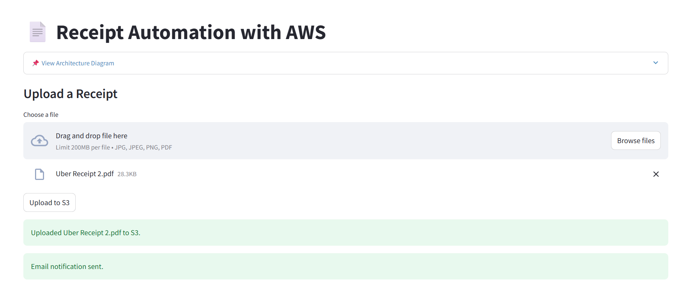

# Receipt Automation with AWS

Built a fully serverless system to automate receipt processing and data extraction using AWS. Users can upload receipts via a Streamlit frontend, triggering backend workflows that extract structured data using Textract and store it in DynamoDB. The system sends real-time email alerts, provides secure file access, and scales cost-effectively with minimal operational overhead. Designed to streamline finance operations like expense tracking and invoice logging.

---

## Tech Stack

| Layer        | Technology              |
|--------------|--------------------------|
| Frontend     | Streamlit (Python)       |
| Cloud Compute| AWS Lambda               |
| OCR Engine   | Amazon Textract          |
| Storage      | Amazon S3                |
| Database     | Amazon DynamoDB          |
| Notification | Amazon SES     |
| Infra Config | Environment Variables, IAM Roles |

---

## Architecture Overview

The system follows an event-driven, serverless architecture using AWS-native services:

---

## How It Works

1. **User Upload**: A user uploads a receipt (image or PDF) via the Streamlit interface.
2. **Store in S3**: The file is stored in an S3 bucket under the `incoming/` directory.
3. **Trigger Lambda**: An S3 event triggers a Lambda function.
4. **Extract Data with Textract**: Lambda uses Amazon Textract to extract structured data like items, total, and date.
5. **Save to DynamoDB**: Parsed data is structured and saved to a DynamoDB table.
6. **Email Notification**: A formatted summary is emailed to a predefined recipient using Amazon SES.
7. **Frontend Display**: The Streamlit frontend can fetch and display all processed receipts along with presigned S3 URLs for direct viewing.

---

## Screenshots

### Streamlit Upload UI

### Processed Receipt Table

### Email Notification Sample

---

## License

This project is licensed under the [MIT License](LICENSE).

## Contact

For inquiries or suggestions, please reach out through [GitHub Repository](https://github.com/AryanShah30/receipt-automation-using-aws).
